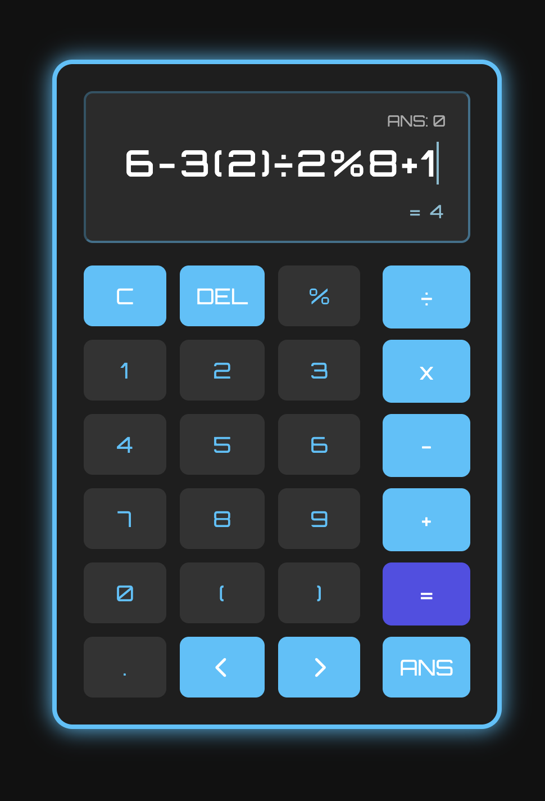

# JavaScript Calculator

A basic calculator built with **HTML**, **CSS** and **JavaScript**, offering real-time result preview, custom cursor control and keyboard support.

## Features
- Custom Cursor: Move left/right through the expression using `<` and `>` keys or on-screen buttons.
- Live Result Preview: Get instant preview of the result while typing.
- ANS Memory: Use the result of your last calculation with `ANS` button or the `a` key
- Keyboard Support: Full keyboard compatibility with visual key feedback.
- Responsive UI: Clean and intuitive layout using modern CSS.

## How to Use

### Keyborad Shortcuts
- `Enter` or `=` -> Calculate
- `Backspace` -> Delete last input
- `Escape` -> Clear screen
- `ArrowLeft` / `ArrowRight` -> Move cursor
- `a` -> Insert `ANS`

## Tech Stack
- HTML, CSS, JavaScript
- [`math.js`](https://mathjs.org/) for expression evaluation

## Future Improvements
- Add sound effects and button animations
- Support expression history
- Allow cursor movement via mouse click
- Allow copying/pasting of expression

## Live Demo
[Live Calculator](https://ni-ki-web.github.io/js-calculator/)
